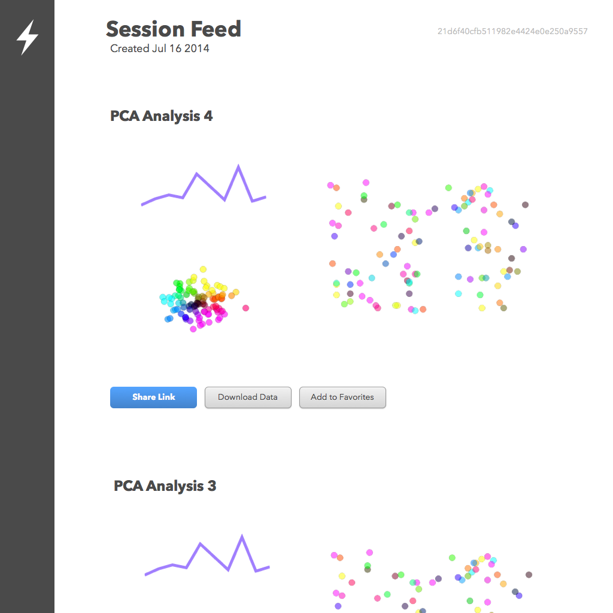
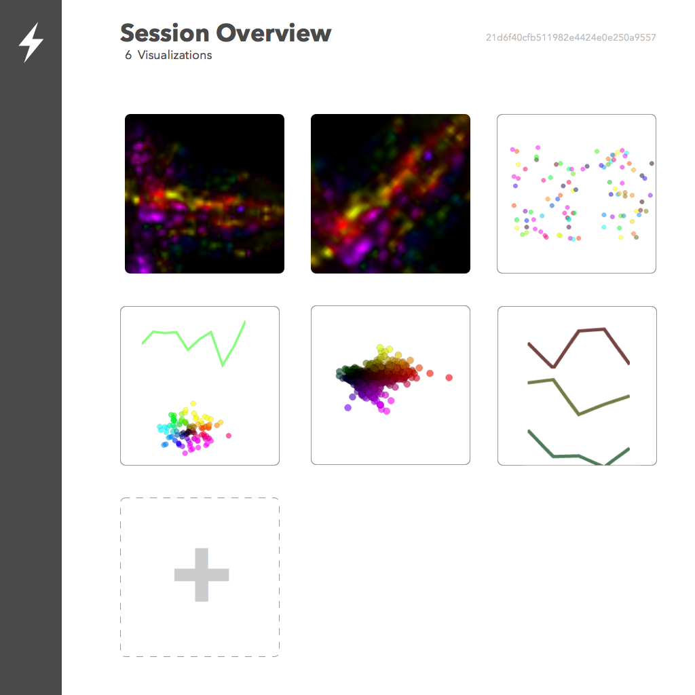
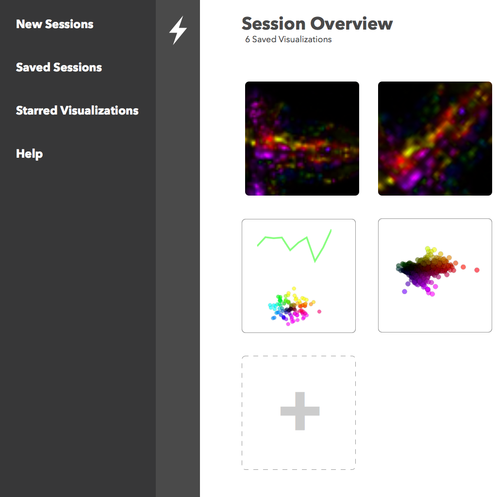

# Lightning

A notebook for storing and sharing custom visualizations

http://lightning.mathisonian.com

[](https://heroku.com/deploy)

## mockups

### Stream of output for current interactive session



### overview of an interactive session



### sidebar showing options



### permalink page for sharing 


## installation

dependencies

* [node.js](http://nodejs.org/)
* postgres


install by running `npm install`. 

Compile client side libraries by running `gulp`. This can just keep running forever.

Run server with `npm start`.


## chart types

### scatter

```javascript
{
  "data": [
    {"x": 10, "y": 5},
    {"x": 11, "y": 4},
    {"x": -3, "y": 0}
  ],
  "type": "scatter"
}
```

### line

```javascript
{
  "data": [1, 7, 8, 9, 11, -10, -3, 11, 2, 100, 0, 1, 20, 25, 27, 80, -10, 20, 30, 40, 30, 43, 50],
  "type": "line"
}
```

### PCA

exact data format tbd
```javascript
{
  "data": {
    "points": [
      {"x": 10, "y": 5, "category": 0}, 
      {"x": 11, "y": 4, "category": 1},
      {"x": -3, "y": 0, "category": 2}
      
    ],
    "categories": [
      [1, 3, 4, 6, 7],
      [1, 0, 4, 8, 6],
      [2, 3, 3, 7, 9]
    ]
  }
  "type": "pca"
}
```
